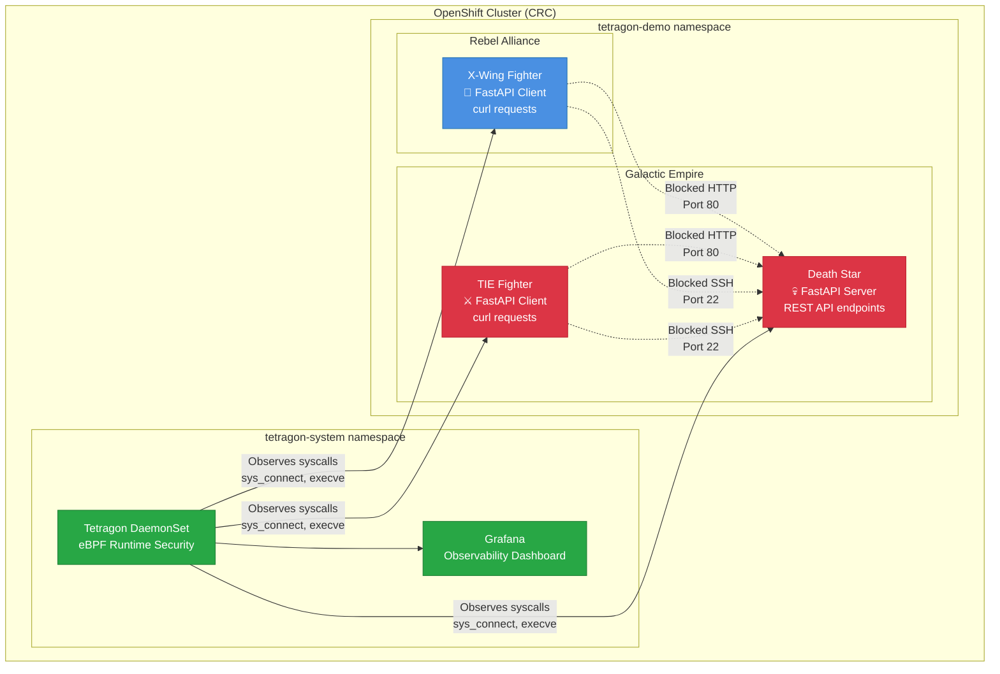
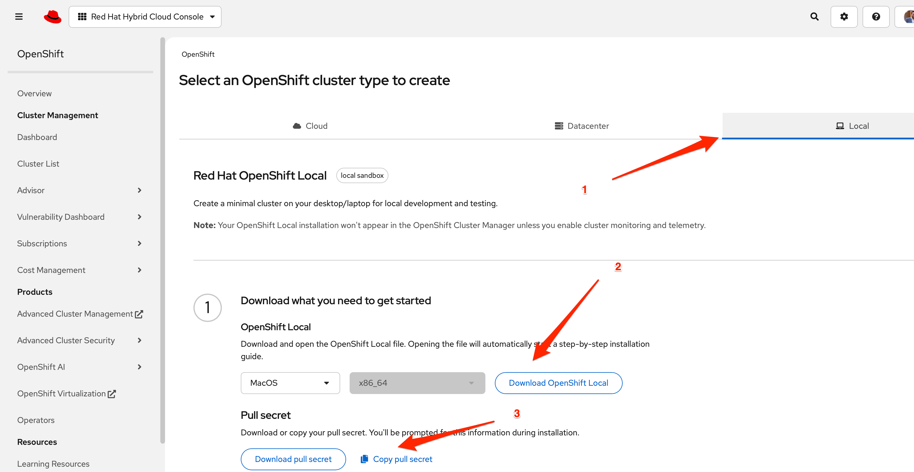

# Tetragon Security Observability + Star Wars Demo on CRC (macOS)

## Summary

**Who:** macOS users running CodeReady Containers (CRC) for OpenShift  
**What:** Deploy Tetragon with integrated Grafana, plus a Star Wars demo workload  
**How:** Using CRC, Helm, OpenShift CLI (`oc`), and provided automation scripts  

---

## Dependencies

### System Requirements

| Component | Minimum | Recommended |
|-----------|---------|-------------|
| **macOS Version** | 10.15 (Catalina) | 12.0+ (Monterey) |
| **RAM** | 12GB available | 16GB+ total |
| **CPU** | 4 cores | 6+ cores |
| **Storage** | 50GB free | 100GB+ free |
| **Architecture** | Intel x86_64 or Apple Silicon | Apple Silicon (M1/M2) |

### Required Software

**Essential Tools:**

```bash
# 1. Homebrew (package manager)
/bin/bash -c "$(curl -fsSL https://raw.githubusercontent.com/Homebrew/install/HEAD/install.sh)"

# 2. Git (version control)
brew install git

# 3. OpenShift CLI (oc)  
brew install openshift-cli

# 4. Helm (Kubernetes package manager)
brew install helm
```

**Optional but Recommended:**

```bash
# kubectl (Kubernetes CLI)
brew install kubectl

# jq (JSON processor for easier log parsing)
brew install jq

# watch (monitor commands in real-time)
brew install watch
```

### Red Hat Account Requirements

- **Red Hat Developer Account** (free)
- **Valid Pull Secret** from Red Hat Cloud Console
- **CRC Binary** (CodeReady Containers)

### Network Requirements

- **Internet access** for downloading images and packages
- **DNS resolution** for registry.redhat.io and quay.io
- **Firewall exceptions** for CRC ports (if corporate firewall)

---

## Demo Architecture



### Component Details

| Component | Technology | Purpose | Communications |
|-----------|------------|---------|----------------|
| **X-Wing** | FastAPI client container | Rebel attack pod | Attempts HTTP requests to Death Star |
| **TIE Fighter** | FastAPI client container | Empire patrol pod | Attempts HTTP requests to Death Star |
| **Death Star** | FastAPI server | Empire command center | Serves REST API (when not blocked) |
| **Tetragon** | eBPF + Kubernetes | Runtime security monitoring | Intercepts and blocks sys_connect syscalls |
| **Grafana** | Observability platform | Security dashboard | Visualizes blocked connection attempts |

---

## 1. Clone the Demo Repository

```bash
git clone https://github.com/Trigas/tetragon-demo.git
cd tetragon-demo
```

---

## 2. Prepare Pull Secret

You need a valid Red Hat pull secret to run CRC.

- Download from: <https://cloud.redhat.com/openshift/install/crc/installer-provisioned>  
- Save as `pull-secret.txt` in this repo.  

⚠️ **Important:** If you are using the pull-secret shared by me, it is for demo purposes only and must **never** be shared outside your local lab. If you have your own pull secret from your Red Hat account, you may use it instead without this restriction.

---

## 3. Install CRC

You have two options:

**Option A: Download from Red Hat**  

- Visit: <https://www.redhat.com/en/blog/codeready-containers>  
- Download the latest macOS installer.  



**Option B: Install via Homebrew**  

```bash
brew install crc
```

---

## 4. Start CRC

```bash
crc setup
crc config set memory 11980
crc start --pull-secret-file pull-secret.txt
```

⚠️ **Note:** Due to Grafana we need to increase teh memory of CRC.

---

## 5. Deploy Tetragon + Grafana + Star Wars Demo

From the repo root (`~/tetragon-demo`):

```bash
./deploy-tetragon-with-grafana.sh
```

This will deploy:

- Tetragon DaemonSet in `tetragon-system` namespace
- Grafana with Tetragon dashboards
- Star Wars demo pods in `tetragon-demo` namespace
- Default observability tracing policies

---

## 6. Demo Scenarios

### Scenario 1: Observe Network Connections (Default Mode)

Apply the observability policy to monitor all connections without blocking:

```bash
# Apply observability policy (observe only)
oc apply -f policies/starwars-observe-syscalls.yaml

# Generate traffic - these will succeed
oc exec -it deployment/xwing -n tetragon-demo -- curl deathstar.tetragon-demo.svc.cluster.local/v1/exhaust-port
oc exec -it deployment/tiefighter -n tetragon-demo -- curl deathstar.tetragon-demo.svc.cluster.local/v1/request-landing

# View events in real-time
kubectl exec -n tetragon-system ds/tetragon -- tetra getevents
```

### Scenario 2: Block Network Connections (Blocking Mode)

Apply the blocking policy to prevent network access:

```bash
# Apply blocking policy (blocks ports 22 and 80)
oc apply -f policies/block_syscall_test.yml

# Try HTTP connection to Death Star API (will be blocked)
oc exec -it deployment/tiefighter -n tetragon-demo -- curl deathstar.tetragon-demo.svc.cluster.local/v1/request-landing

# Try SSH connection (will be blocked)  
oc exec -it deployment/xwing -n tetragon-demo -- curl deathstar:22
```

⚠️ **Result:** Both HTTP (port 80) and SSH (port 22) connections will be blocked, and the process making the connection will be killed.

---

## 7. Understanding the Blocking Policy

The current `block_syscall_test.yml` policy blocks **both ports 22 and 80**:

```yaml
# Current policy blocks both SSH and HTTP
selectors:
- matchArgs:
  - index: 1
    operator: "SPort"
    values: ["22","80"]  # Blocks both SSH and HTTP
  matchActions:
  - action: "Sigkill"    # Kills the process attempting connection
```

### Policy Variations

#### Option A: Block only HTTP (Death Star API)

```yaml
values: ["80"]  # Only block HTTP traffic
```

#### Option B: Block only SSH

```yaml
values: ["22"]  # Only block SSH access
```

#### Option C: Block with custom message

```yaml
matchActions:
- action: "Sigkill"
  message: "Connection blocked by Tetragon security policy"
```

---

## 8. Access Dashboards

```bash
# Get Grafana URL
oc get route grafana -n tetragon-system

# OpenShift Console
crc console
```

Default credentials: `admin/admin`

**What you'll see:**

- Connection attempts from X-Wing and TIE Fighter
- Blocked connections (when blocking policy is active)
- Process terminations due to policy violations

---

## 9. Troubleshooting

### Common Issues

**CRC won't start:**

```bash
# Check available resources
system_profiler SPHardwareDataType | grep Memory
crc config view

# Increase memory if needed
crc config set memory 14336
```

**Policy not blocking:**

```bash
# Check if policy is applied
oc get tracingpolicy
oc describe tracingpolicy block-connect-syscall-sport

# Check Tetragon logs
oc logs -f ds/tetragon -n tetragon-system
```

**Demo pods not ready:**

```bash
# Check demo namespace
oc get pods -n tetragon-demo
oc describe pod <pod-name> -n tetragon-demo
```

**Dependencies missing:**

```bash
# Verify all tools are installed
which oc helm kubectl crc
oc version
helm version
```

### Useful Commands

```bash
# Monitor events in real-time
watch kubectl exec -n tetragon-system ds/tetragon -- tetra getevents

# Check resource usage
oc top nodes
oc top pods -A

# View all Tetragon policies
oc get tracingpolicy -o wide
```

---

## 10. Cleanup

```bash
# Remove blocking policy (restore normal operation)
oc delete -f policies/block_syscall_test.yml

# Stop CRC (preserves data)
crc stop

# Delete CRC completely (removes all data)
crc delete
```

---

## 11. References

- [Tetragon Documentation](https://tetragon.io/docs/)
- [Red Hat CRC](https://www.redhat.com/en/blog/codeready-containers)  
- [Star Wars Demo](https://github.com/cilium/star-wars-demo)
- [eBPF Introduction](https://ebpf.io/what-is-ebpf/)
- [OpenShift CLI Reference](https://docs.openshift.com/container-platform/latest/cli_reference/openshift_cli/getting-started-cli.html)

---

**⭐ Star this repo if it helped you learn Tetragon runtime security!**
