# Tetragon Security Observability + Star Wars Demo on CRC (macOS)

## Summary

**Who:** macOS users running CodeReady Containers (CRC) for OpenShift  
**What:** Deploy Tetragon with integrated Grafana, plus a Star Wars demo workload  
**How:** Using CRC, Helm, OpenShift CLI (`oc`), and provided automation scripts  

---

## Dependencies

### System Requirements

| Component | Minimum | Recommended |
|-----------|---------|-------------|
| **macOS Version** | 10.15 (Catalina) | 12.0+ (Monterey) |
| **RAM** | 12GB available | 16GB+ total |
| **CPU** | 4 cores | 6+ cores |
| **Storage** | 50GB free | 100GB+ free |
| **Architecture** | Intel x86_64 or Apple Silicon | Apple Silicon (M1/M2) |

### Required Software

**Essential Tools:**

```bash
# 1. Homebrew (package manager)
/bin/bash -c "$(curl -fsSL https://raw.githubusercontent.com/Homebrew/install/HEAD/install.sh)"

# 2. Git (version control)
brew install git

# 3. OpenShift CLI (oc)  
brew install openshift-cli

# 4. Helm (Kubernetes package manager)
brew install helm
```

**Optional but Recommended:**

```bash
# kubectl (Kubernetes CLI)
brew install kubectl

# jq (JSON processor for easier log parsing)
brew install jq

# watch (monitor commands in real-time)
brew install watch
```

### Red Hat Account Requirements

- **Red Hat Developer Account** (free)  
- **Valid Pull Secret** from Red Hat Cloud Console  
- **CRC Binary** (CodeReady Containers)  

### Network Requirements

- **Internet access** for downloading images and packages  
- **DNS resolution** for registry.redhat.io and quay.io  
- **Firewall exceptions** for CRC ports (if corporate firewall)  

---

## Demo Architecture

```mermaid
graph TB
    subgraph "OpenShift Cluster (CRC)"
        subgraph "tetragon-system namespace"
            T[Tetragon DaemonSet<br/>eBPF Runtime Security]
            G[Grafana<br/>Observability Dashboard]
            T --> G
        end
        
        subgraph "tetragon-demo namespace"
            subgraph "Rebel Alliance"
                X[X-Wing Fighter<br/>🚀 FastAPI Client<br/>curl requests<br/>org=alliance]
            end
            
            subgraph "Galactic Empire"  
                TF[TIE Fighter<br/>⚔️ FastAPI Client<br/>curl requests<br/>org=empire]
                DS[Death Star<br/>💀 FastAPI Server<br/>REST API endpoints]
                S[Secret Test Pod<br/>🔐 Busybox container<br/>local file secrets]
            end
        end
    end

    %% Traffic flows
    X -->|HTTP/SSH attempts| DS
    TF -->|HTTP/SSH attempts| DS
    
    %% Monitoring flows
    T -->|Observes syscalls<br/>sys_connect, execve, openat2 | X
    T --> TF
    T --> DS
    T --> S
```



### Component Details

| Component | Technology | Purpose | Communications |
|-----------|------------|---------|----------------|
| **X-Wing** | FastAPI client container | Rebel attack pod | Attempts HTTP/SSH requests to Death Star |
| **TIE Fighter** | FastAPI client container | Empire patrol pod | Attempts HTTP/SSH requests to Death Star |
| **Death Star** | FastAPI server | Empire command center | Serves REST API (when not blocked) |
| **Secret Test Pod** | Busybox | File access test pod | Hosts `/opt/demo/secret.txt` |
| **Tetragon** | eBPF + Kubernetes | Runtime security monitoring | Intercepts syscalls, kills offending processes |
| **Grafana** | Observability platform | Security dashboard | Visualizes syscall events and alerts |

---

## 1. Clone the Demo Repository

```bash
git clone https://github.com/Trigas/tetragon-demo.git
cd tetragon-demo
```

---

## 2. Prepare Pull Secret

Download from: <https://cloud.redhat.com/openshift/install/crc/installer-provisioned>  
Save as `pull-secret.txt` in this repo.  

⚠️ **Note:** Demo pull-secret must **never** be shared outside your local lab. Use your own Red Hat account for production.  

---

## 3. Install CRC

Option A: Download from Red Hat  
Option B: Install via Homebrew  

```bash
brew install crc
```

---

## 4. Start CRC

```bash
crc setup
crc config set memory 11980
crc start --pull-secret-file pull-secret.txt
```

⚠️ Increase memory because of Grafana.  

---

## 5. Deploy Tetragon + Grafana + Star Wars Demo

```bash
./deploy-tetragon-with-grafana.sh
```

This deploys:  
- Tetragon DaemonSet (`tetragon-system`)  
- Grafana dashboards  
- Star Wars demo pods (`tetragon-demo`)  
- Default tracing policies  

---

## 6. Tracing Policies: Observability vs Blocking

Tetragon policies are defined as **TracingPolicies**.  A `TracingPolicy` is a Kubernetes CRD (`cilium.io/v1alpha1`) that lets you hook syscalls (e.g., `sys_connect`, `openat`, `execve`) via `kprobes`. You capture args (sock, filename, etc.), filter with selectors (namespace/pod/matchArgs), and apply actions like `Sigkill` or `Record`.

### Observability (starwars-observe-syscalls.yaml)

- Hooks syscalls (`sys_connect`, `execve`)  
- **Logs only** (no actions)  
- Connections succeed but appear in Tetragon and Grafana  

⚠️ **Note:**This policy has been applied with  the installation script - no need to  install it again!!

```bash
# Apply the observability TracingPolicy
oc apply -f policies/starwars-observe-syscalls.yaml

# Restart the X-Wing pod so the policy is applied
oc -n tetragon-demo delete pod xwing --ignore-not-found
oc -n tetragon-demo wait --for=delete pod/xwing --timeout=60s
oc -n tetragon-demo apply -f - <<'YAML'
apiVersion: v1
kind: Pod
metadata:
  name: xwing
  labels:
    app.kubernetes.io/name: xwing
    app.kubernetes.io/part-of: starwars-demo
    class: xwing
    org: alliance
spec:
  containers:
    - name: curl
      image: curlimages/curl:8.7.1
      command: ["sleep","infinity"]
YAML
oc -n tetragon-demo wait --for=condition=Ready pod/xwing --timeout=120s

# Open a new terminal an use tetra cli to stream the events
tetra getevents --namespace tetragon-demo --color always -o compact

# Trigger some traffic (X-Wing curl to Death Star)
oc -n tetragon-demo exec xwing -- curl http://deathstar.tetragon-demo.svc.cluster.local/v1/request-landing
```

### Blocking (block_syscall_test.yml, starwars-block-xwing-ssh.yml)

- Hooks `sys_connect` / `__arm64_sys_connect`  
- Matches destination ports and/or pod labels  
- Action: `Sigkill` → kill offending process  

⚠️ **Note:** In CRC, **LSM not available**. Enforcement = **detect then kill**, not prevent.  

This policy prevents the **X-Wing pod** from connecting to the Death Star on **port 22 (SSH)**.  
It combines syscall-level and function-level probes to catch both IPv4 and IPv6 TCP connect attempts.  
If a match is found, the offending process is killed with `SIGKILL`.

- **Hooks**  
  - `__arm64_sys_connect` / `sys_connect` → syscall path (captures `sockaddr`)  
  - `tcp_v4_connect` / `tcp_v6_connect` → kernel TCP functions (captures socket)  
- **Scope**: namespace `tetragon-demo`, pods with label `app.kubernetes.io/name=xwing`  
- **Action**: `Sigkill` (terminate the process)  

⚠️ **Note:** In CRC, **LSM is not available**. Enforcement works as **detect then kill**, not true pre-blocking.

**Run the demo:**

```bash
# Apply the blocking TracingPolicy
oc apply -f policies/starwars-block-xwing-ssh.yml

# Restart the X-Wing pod so the policy is applied
oc -n tetragon-demo delete pod xwing --ignore-not-found
oc -n tetragon-demo wait --for=delete pod/xwing --timeout=60s
oc -n tetragon-demo apply -f - <<'YAML'
apiVersion: v1
kind: Pod
metadata:
  name: xwing
  labels:
    app.kubernetes.io/name: xwing
    app.kubernetes.io/part-of: starwars-demo
    class: xwing
    org: alliance
spec:
  containers:
    - name: curl
      image: curlimages/curl:8.7.1
      command: ["sleep","infinity"]
YAML
oc -n tetragon-demo wait --for=condition=Ready pod/xwing --timeout=120s

# Open a new terminal an use tetra cli to stream the events
tetra getevents --namespace tetragon-demo --color always -o compact

# Attempt SSH (curl to port 22) from the X-Wing
oc -n tetragon-demo exec xwing -- curl -v --connect-timeout 2 deathstar.tetragon-demo.svc.cluster.local:22

```

---

## 7. File Access Control Test Pod

```bash
oc -n tetragon-demo run secret-test   --image=busybox   --restart=Never   --command -- sleep 3600

oc -n tetragon-demo exec secret-test -- sh -lc '
  mkdir -p /opt/demo &&   echo "THERMAL EXHAUST PORT: SUPER SECRET" > /opt/demo/secret.txt &&   chmod 600 /opt/demo/secret.txt'
```

Apply a policy to block reads:  

```yaml
apiVersion: cilium.io/v1alpha1
kind: TracingPolicy
metadata:
  name: block-secret-open
spec:
  kprobes:
  - call: __arm64_sys_openat
    syscall: true
    return: false
    args:
    - index: 0
      type: filename
      label: file
    selectors:
    - matchArgs:
      - index: 0
        operator: Prefix
        values: ["/opt/demo/secret.txt"]
      matchActions:
      - action: Sigkill
```

---

## 8. Grafana Dashboards & Alerts

Dashboards included:  
- **Star-Wars Landing Dashboard**  
- **Tetragon Events Dashboard**  
- **File Access Intrusion Dashboard** (import separately)  

### Import File Access Intrusion Dashboard

1. In Grafana → Dashboards → Import  
2. Upload `grafana_file_access_intrusion_dashboard.json`  
3. Select `tetragon-prometheus` datasource  
4. Variables:  
   - namespace = `tetragon-demo`  
   - filename = `/opt/demo/secret.txt`  

### Alerting

- Condition: file access > 0 for 1m  
- Message: 🚨 File access intrusion: $filename in $namespace  

PromQL for Unified Alerting:

```promql
sum(
  rate(tetragon_events_total{
    job="tetragon",
    namespace="tetragon-demo",
    function=~"__arm64_sys_openat.*|sys_openat.*|.*openat.*",
    filename="/opt/demo/secret.txt"
  }[5m])
)
```

---

## 9. Developer Tips

### Quick CRC Login Helper (`crcdev`)

Add this to `~/.zshrc`:

```zsh
crcdev() {
    eval "$(crc oc-env)"
    local PW
    PW="$(crc console --credentials         | grep -F "kubeadmin"         | sed -E 's/.*-p ([^ ]+).*//')"
    oc login -u kubeadmin -p "$PW" https://api.crc.testing:6443
}
```

Reload shell:

```bash
source ~/.zshrc
```

Use:

```bash
crcdev
```

✅ Auto-logs you into CRC as kubeadmin.

---

## 10. Cleanup

```bash
oc delete -f policies/block_syscall_test.yml
oc delete -f policies/starwars-observe-syscalls.yaml
crc stop
```

---

## References

- [Tetragon Docs](https://tetragon.io/docs/)  
- [Red Hat CRC](https://www.redhat.com/en/blog/codeready-containers)  
- [Star Wars Demo](https://github.com/cilium/star-wars-demo)  
- [eBPF](https://ebpf.io/what-is-ebpf/)  
- [OpenShift CLI](https://docs.openshift.com/container-platform/latest/cli_reference/openshift_cli/getting-started-cli.html)  

---

**⭐ Star this repo if it helped you learn Tetragon runtime security!**
