# Tetragon Security Observability + Star Wars Demo on CRC (macOS)

## Summary

**Who:** macOS users running CodeReady Containers (CRC) for OpenShift  
**What:** Deploy Tetragon with integrated Grafana, plus a Star Wars demo workload  
**How:** Using CRC, Helm, OpenShift CLI (`oc`), and provided automation scripts  

---

## Dependencies

### System Requirements

| Component | Minimum | Recommended |
|-----------|---------|-------------|
| **macOS Version** | 10.15 (Catalina) | 12.0+ (Monterey) |
| **RAM** | 12GB available | 16GB+ total |
| **CPU** | 4 cores | 6+ cores |
| **Storage** | 50GB free | 100GB+ free |
| **Architecture** | Intel x86_64 or Apple Silicon | Apple Silicon (M1/M2) |

### Required Software

**Essential Tools:**

```bash
# 1. Homebrew (package manager)
/bin/bash -c "$(curl -fsSL https://raw.githubusercontent.com/Homebrew/install/HEAD/install.sh)"

# 2. Git (version control)
brew install git

# 3. OpenShift CLI (oc)  
brew install openshift-cli

# 4. Helm (Kubernetes package manager)
brew install helm
```

**Optional but Recommended:**

```bash
# kubectl (Kubernetes CLI)
brew install kubectl

# jq (JSON processor for easier log parsing)
brew install jq

# watch (monitor commands in real-time)
brew install watch
```

### Red Hat Account Requirements

- **Red Hat Developer Account** (free)
- **Valid Pull Secret** from Red Hat Cloud Console
- **CRC Binary** (CodeReady Containers)

### Network Requirements

- **Internet access** for downloading images and packages
- **DNS resolution** for registry.redhat.io and quay.io
- **Firewall exceptions** for CRC ports (if corporate firewall)

---

## Demo Architecture

```mermaid
graph TB
    subgraph "OpenShift Cluster (CRC)"
        subgraph "tetragon-system namespace"
            T[Tetragon DaemonSet<br/>eBPF Runtime Security]
            G[Grafana<br/>Observability Dashboard]
            T --> G
        end
        
        subgraph "tetragon-demo namespace"
            subgraph "Rebel Alliance"
                X[X-Wing Fighter<br/>🚀 FastAPI Client<br/>curl requests<br/>org=alliance]
            end
            
            subgraph "Galactic Empire"  
                TF[TIE Fighter<br/>⚔️ FastAPI Client<br/>curl requests<br/>org=empire]
                DS[Death Star<br/>💀 FastAPI Server<br/>REST API endpoints]
                S[Secret Test Pod<br/>🔐 Busybox container<br/>local file secrets]
            end
        end
    end

    %% Traffic flows
    X -->|HTTP/SSH attempts| DS
    TF -->|HTTP/SSH attempts| DS
    
    %% Monitoring flows
    T -->|Observes syscalls<br/>sys_connect, execve, openat| X
    T --> TF
    T --> DS
    T --> S
```



---

## Tracing Policies: Observability vs Blocking

Tetragon policies are defined as **TracingPolicies** (CRDs). They hook syscalls via kprobes and optionally take actions.

### 1. Observability (starwars-observe-syscalls.yaml)

- Hooks syscalls (`sys_connect`, `execve`).  
- **No actions** → only logs the events.  
- Example: see all curl attempts from X-Wings/TIE Fighters to the Death Star.  

```bash
oc apply -f policies/starwars-observe-syscalls.yaml
kubectl exec -n tetragon-system ds/tetragon -- tetra getevents
```

✅ Connections succeed, but appear in Tetragon and Grafana【10†starwars-observe-syscalls.yaml】.

---

### 2. Blocking (block_syscall_test.yml, starwars-block-xwing-ssh.yml)

- Hooks `sys_connect` / `__arm64_sys_connect`.  
- Matches **destination ports** (22 = SSH, 80 = HTTP) and/or **pod labels**.  
- Action: `Sigkill` → kill offending process【8†block_syscall_test.yml】【9†starwars-block-xwing-ssh.yml】.

⚠️ **Important:** In CRC, **LSM is not available**, so Tetragon cannot pre-block. Instead:  
- The syscall executes.  
- Tetragon detects violation.  
- The offending process is **killed after the syscall**.  

So enforcement is “detect then kill”, not “prevent at entry”.

Example:

```bash
oc apply -f policies/starwars-block-xwing-ssh.yml

# This SSH attempt from the X-Wing will be killed
oc -n tetragon-demo exec deploy/xwing -- curl deathstar.tetragon-demo.svc.cluster.local:22
```

---

## New Scenario: File Access Control Test Pod

Beyond network calls, you can also test **file access monitoring**.

### Deploy the Pod

```bash
oc -n tetragon-demo run secret-test   --image=busybox   --restart=Never   --command -- sleep 3600

oc -n tetragon-demo exec secret-test -- sh -lc '
  mkdir -p /opt/demo &&   echo "THERMAL EXHAUST PORT: SUPER SECRET" > /opt/demo/secret.txt &&   chmod 600 /opt/demo/secret.txt'
```

### Purpose

- Simulates an app writing sensitive data.  
- Use a `TracingPolicy` with kprobe on `openat` to detect unauthorized file access.  
- Events show in `tetra getevents` and Grafana dashboards.

Example policy snippet:

```yaml
apiVersion: cilium.io/v1alpha1
kind: TracingPolicy
metadata:
  name: block-secret-open
spec:
  kprobes:
  - call: __arm64_sys_openat
    syscall: true
    return: false
    args:
    - index: 0
      type: filename
      label: file
    selectors:
    - matchArgs:
      - index: 0
        operator: Prefix
        values: ["/opt/demo/secret.txt"]
      matchActions:
      - action: Sigkill
```

---

## Demo Scenarios

### Scenario 1 – Observe Connections
Apply observability policy, connections succeed but are logged.

### Scenario 2 – Block Connections
Apply blocking policy, offending process is killed after the syscall.

### Scenario 3 – File Access Monitoring
Apply openat policy to block or log access to `/opt/demo/secret.txt`.

---

## Grafana Dashboards & Alerts

Two dashboards included:

- **Star-Wars Landing Dashboard** (landing attempts vs blocks)  
- **Tetragon Events Dashboard** (generic exec/curl events)  

### Import the File Access Intrusion Dashboard

1. In Grafana → Dashboards → Import.  
2. Upload `grafana_file_access_intrusion_dashboard.json`.  
3. Select your **tetragon-prometheus** datasource.  
4. Variables:  
   - `namespace`: defaults to `tetragon-demo`  
   - `filename`: defaults to `/opt/demo/secret.txt`  

### How it Works

- PromQL queries `tetragon_events_total` for `openat` syscalls on `$filename`.  
- In CRC, Tetragon uses **detect-then-kill**.  
- Both timeseries and stat panels show file access activity.

### Alerting

- The Intrusion detector panel includes an alert:  
  - **Condition:** file access rate > 0 for 1m  
  - **Message:** “🚨 File access intrusion: $filename accessed in $namespace”  
- For Grafana Unified Alerting, create an equivalent rule:

```promql
sum(
  rate(tetragon_events_total{
    job="tetragon",
    namespace="tetragon-demo",
    function=~"__arm64_sys_openat.*|sys_openat.*|.*openat.*",
    filename="/opt/demo/secret.txt"
  }[5m])
)
```

Trigger if `> 0` for 1m and send to Slack/Email/Teams.

---

## Cleanup

```bash
# Remove policies
oc delete -f policies/block_syscall_test.yml
oc delete -f policies/starwars-observe-syscalls.yaml

# Stop CRC
crc stop
```

---

**⭐ Star this repo if it helped you learn Tetragon runtime security!**
